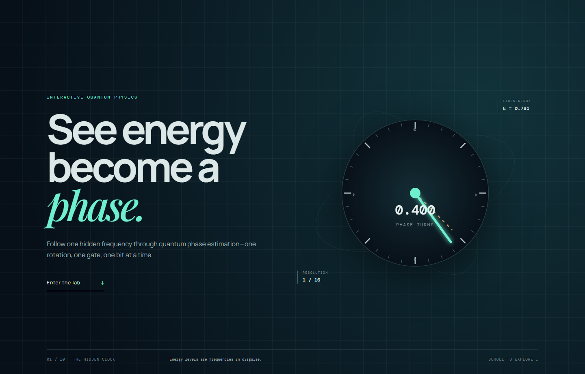
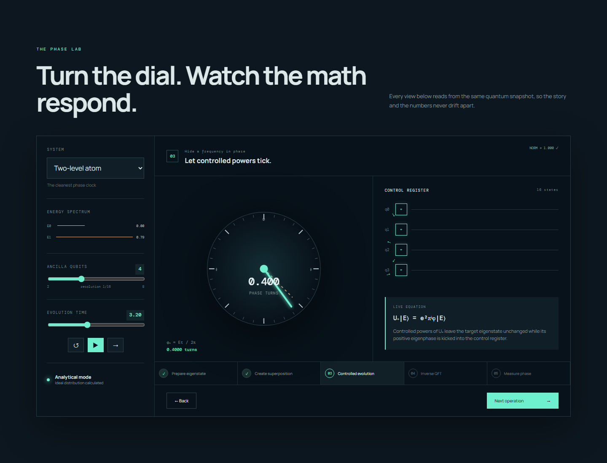
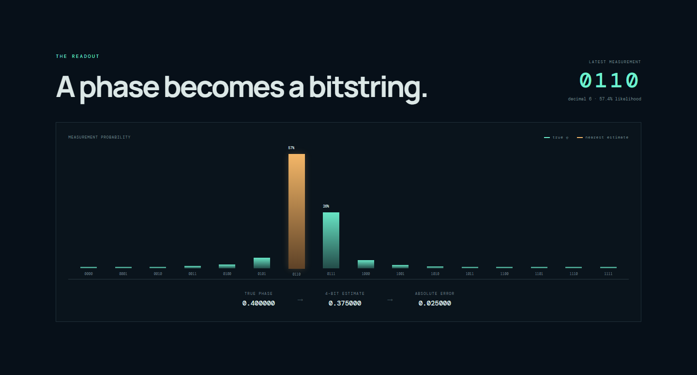

# PhaseDial

[](https://github.com/Byt-wyze-technology/PhaseDial/actions/workflows/ci.yml)
[](https://react.dev/)
[](https://www.typescriptlang.org/)
[](LICENSE)

**See energy become a phase. Read the invisible dial.**

Quantum phase estimation is one of the most useful ideas in quantum computing.
It sits inside algorithms for finding energies, simulating molecules, and
factoring numbers. But it is often taught as a wall of circuit diagrams before
anyone explains what the circuit is trying to see.

The idea is much simpler than the circuit makes it look:

> An energy eigenstate behaves like a clock. Its hand turns at a rate set by
> its energy. Quantum phase estimation reads that hidden clock.

I built **PhaseDial** to make that idea visible. You can change the energy,
change how long the state evolves, step through the algorithm, and watch a
hidden phase turn into an ordinary binary number.

This is a learning tool. It runs on a normal laptop and does not connect to a
quantum computer.

## Who should use PhaseDial?

- Students meeting quantum phase estimation for the first time.
- Software engineers who understand algorithms better by changing inputs.
- Teachers looking for an interactive classroom demonstration.
- Anyone who wants intuition before working through the full linear algebra.

## Interactive teaching app



---

## The one idea you need

Imagine a system with an energy value $E$. If the system starts in an energy
eigenstate, time evolution does not move it to another energy level. Instead,
standard forward Schrödinger evolution adds a complex phase. PhaseDial uses
natural units, so $\hbar=1$:

$$
U_{\mathrm{fwd}}(t)|E\rangle=e^{-iEt}|E\rangle.
$$

PhaseDial deliberately gives its clock the opposite, positive orientation. It
applies the adjoint unitary

$$
U_+(t)=U_{\mathrm{fwd}}^\dagger(t)=e^{+iHt},
$$

so that the standard QPE eigenphase convention

$$
U|\psi\rangle=e^{2\pi i\phi}|\psi\rangle
$$

gives the displayed phase

$$
\phi=\frac{Et}{2\pi}\pmod 1.
$$

The dial therefore shows the eigenphase of $U_+$, not the eigenphase of ordinary
forward evolution $U_{\mathrm{fwd}}$. The `mod 1` means that after one full
turn, the hand starts around the dial again.

Here is the default example:

```text
energy E = π/4
time   t = 3.2

phase φ = (π/4 × 3.2) / 2π = 0.4 turns
```

That is why the default dial points to `0.400`.

The difficult part is that this phase is invisible if it belongs to the whole
state. Measuring the energy state by itself does not reveal where the clock
hand is pointing.

Quantum phase estimation solves that problem by turning one invisible phase
into many **relative phases** that can interfere with each other.

---

## How quantum phase estimation reads the clock

PhaseDial breaks the algorithm into five steps.

### 1. Prepare an energy eigenstate

We begin with a state whose energy is well defined:

$$
H|E\rangle=E|E\rangle.
$$

This matters because an eigenstate keeps the same physical probabilities while
its phase rotates. It gives us one clean frequency to estimate.

### 2. Create a control register

We add a small group of ancilla qubits and place them in a uniform
superposition. If there are $n$ ancillas, the register represents
$2^n$ different time labels at once:

$$
\frac{1}{\sqrt{2^n}}\sum_{x=0}^{2^n-1}|x\rangle.
$$

You can think of these labels as several clocks that are about to run for
different lengths of time.

### 3. Apply controlled evolution

Each control value $x$ applies a corresponding power of PhaseDial's selected
unitary $U_+$:

$$
|x\rangle|E\rangle
\longrightarrow
e^{2\pi i\phi x}|x\rangle|E\rangle.
$$

The energy state comes back unchanged. The useful information appears in the
relative phases of the control register. This is **phase kickback**. Using
$U_+$ here is the deliberate convention that keeps positive energy moving in
the dial's positive direction.



### 4. Apply the inverse Quantum Fourier Transform

At this point the answer is spread across a pattern of complex phases. That
pattern still cannot be read directly.

The inverse Quantum Fourier Transform makes the control states interfere.
Values that agree with the hidden phase reinforce each other. Values that do
not agree mostly cancel out. The result is a probability peak near
$2^n\phi$.

The QFT does not magically create the answer. It changes the basis so that a
phase pattern becomes a position we can measure.

### 5. Measure

Measurement returns a normal bitstring such as:

```text
0110
```

For four ancilla qubits this means:

```text
binary 0110 = decimal 6
estimated phase = 6 / 16 = 0.375 turns
```

The true phase in the default example is `0.400`, so `0.375` is the nearest
four-bit estimate.

---

## Why the answer is a probability distribution

A register with $n$ ancillas has only $2^n$ possible answers. Four ancillas
can point to:

```text
0/16, 1/16, 2/16, ... 15/16
```

But `0.400` is not exactly on that grid. The algorithm therefore cannot place
all probability on one exact answer. Most probability gathers around the
closest values instead.



In the chart:

- the tall bars are the bitstrings you are most likely to measure;
- the highlighted bar is the latest sampled result;
- the values underneath compare the true phase with the nearest finite-bit
  estimate;
- increasing the ancilla count makes the grid finer.

Every extra ancilla doubles the available phase resolution:

| Ancillas | Possible outcomes | Phase spacing |
| ---: | ---: | ---: |
| 2 | 4 | $1/4$ |
| 3 | 8 | $1/8$ |
| 4 | 16 | $1/16$ |
| 8 | 256 | $1/256$ |

More ancillas mean more precision, but never infinite precision.

---

## The bridge: classical frequency finding and QPE

There is a useful classical picture.

If you record a rotating signal at many times, a Fourier transform can reveal
its frequency. Quantum phase estimation follows the same broad pattern:

| Classical signal processing | Quantum phase estimation |
| --- | --- |
| A signal rotates at an unknown frequency | An eigenstate accumulates an unknown phase |
| Record the signal at several times | Apply controlled evolution for several time labels |
| A Fourier transform reveals a frequency peak | An inverse QFT creates a phase peak |
| Read the peak location | Measure a bitstring |

The analogy explains why a Fourier transform appears. It does **not** mean this
browser app reproduces a quantum speed-up. PhaseDial calculates small ideal
examples classically.

---

## Try it yourself

You need Node.js 24 or later and npm 10 or later.

```bash
git clone https://github.com/Byt-wyze-technology/PhaseDial.git
cd PhaseDial
npm ci
npx playwright install chromium
npm run dev
```

Open the local address printed by Vite.

Try these experiments:

1. Set the two-level atom to time `4.0`. The phase should be half a turn.
2. Pause between two phase-grid points and raise the ancilla count.
3. Step from **Prepare eigenstate** to **Measure phase** one operation at a
   time.
4. Measure the same phase several times and compare the returned bitstrings.
5. Change physical systems and watch the energy change the rotation rate.

Run the checks:

```bash
npm run check
```

This audits the complete dependency tree for high- or critical-severity known
advisories, runs the deterministic numerical suite, builds the production app,
and runs the Chromium regressions. To run the layers separately:

```bash
npm test
npm run test:browser
```

Regenerate the README screenshots after a visible UI change:

```bash
npx playwright install chromium
npm run screenshots
```

---

## What's in here

- `src/engine.ts` — phase wrapping and circular distance, the finite-bit
  estimate, ideal QPE probabilities, and measurement sampling.
- `src/App.tsx` — the interactive lesson, controls, and visualizations.
- `src/engine.test.ts` — deterministic numerical invariant and boundary tests.
- `tests/phase-boundary.pw.ts` — Chromium regression coverage for the
  zero-one phase boundary and measurement interaction.
- `scripts/capture-readme-screenshots.mjs` — captures the three figures above
  from the production build.
- `docs/` — the product vision, implemented mathematical model, architecture,
  and roadmap.
- `.github/` — CI, Dependabot, issue forms, and the pull-request template.

The numerical engine is deliberately separate from the React interface. The
dial, estimate, and probability chart all read from the same calculated state.

For more detail:

- [Product vision](docs/PRODUCT_VISION.md)
- [Mathematical model](docs/MATHEMATICAL_MODEL.md)
- [Architecture](docs/ARCHITECTURE.md)
- [Roadmap](docs/ROADMAP.md)
- [Changelog](CHANGELOG.md)

---

## What this is — and what it isn't

PhaseDial **is** a teaching tool for building intuition about energy phase,
phase kickback, the inverse QFT, and finite-bit measurement. Play with it, make
a prediction, change a control, and see whether the result matches.

It **isn't** a quantum-hardware interface, a noisy-device simulator, or a full
joint state-vector engine. The current release calculates the ideal
finite-register QPE distribution for one selected eigenphase. The moving qubit
arrows and circuit stages are teaching illustrations built around those
calculated values.

It also does not claim quantum advantage. These examples are intentionally
small enough to run instantly in a web browser.

---

## Contributing

Contributions are welcome. Read [CONTRIBUTING.md](CONTRIBUTING.md), follow the
[Code of Conduct](CODE_OF_CONDUCT.md), and check the
[open issues](https://github.com/Byt-wyze-technology/PhaseDial/issues).

Please report vulnerabilities privately using the process in
[SECURITY.md](SECURITY.md).

## License

MIT — see [LICENSE](LICENSE).
